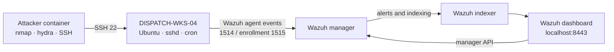
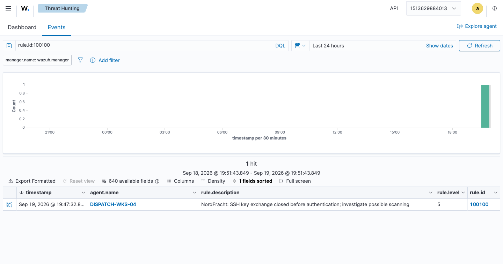
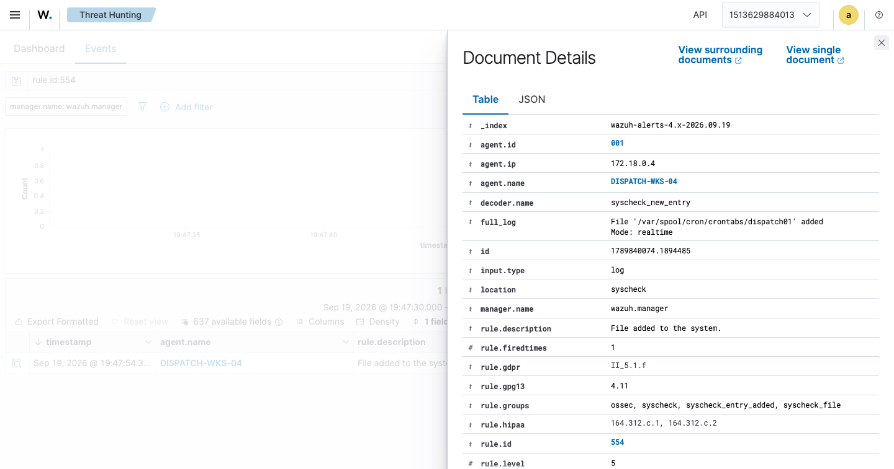

# NordFracht SOC Incident Lab

A single-machine SOC portfolio exercise for **NordFracht Logistics**, a fictional freight company with about 200 employees. A dispatch workstation, `DISPATCH-WKS-04`, exposes a deliberately weak SSH account. An attacker scans SSH, tries a short password list, then installs a harmless cron entry. The Wazuh agent forwards endpoint evidence to a single-node Wazuh stack so an analyst can investigate and write an incident report.

> **Lab boundary:** All attack activity documented here was performed in an isolated, self-owned Docker lab. No third-party targets were involved. The target SSH port is accessible only on the Compose network; the Wazuh dashboard binds to `127.0.0.1:8443`.

## Architecture



The stack uses the [official Wazuh Docker single-node quickstart](https://github.com/wazuh/wazuh-docker/tree/v4.14.7/single-node), pinned to **v4.14.7**. `scripts/setup.sh` downloads that tagged upstream Compose/configuration into the ignored `.runtime/` directory, stages a copy under the host's temporary directory for Docker bind mounts, generates the upstream TLS certificates, then applies this repository's Compose overlay. The target image installs the matching Wazuh agent version and enrolls itself on first start. No cloud services are needed; the initial image/package downloads need internet access.

The staged manager configuration disables Wazuh's vulnerability feed. This exercise detects SSH activity and cron changes; vulnerability scanning is outside its scope and can consume substantial disk space on a small lab host.

## Attack chain and evidence

| Stage | ATT&CK | Exercise action | Expected evidence |
| --- | --- | --- | --- |
| 1. Recon | [T1595 Active Scanning](https://attack.mitre.org/techniques/T1595/) | `nmap` probes the target SSH service | Custom rule `100100` flags an SSH key exchange closed before authentication. Correlate with the saved Nmap output; an endpoint agent does not see the complete port scan. |
| 2. Brute force | [T1110 Brute Force](https://attack.mitre.org/techniques/T1110/) | `hydra` tries a three-entry password list for `dispatch01` | Repeated SSH authentication failures followed by success, with source IP and agent name. |
| 3. Persistence | [T1053.003 Cron](https://attack.mitre.org/techniques/T1053/003/) | The attacker adds a one-minute cron entry that only writes a local syslog marker | Wazuh file integrity alert for `/var/spool/cron/crontabs/dispatch01`; verify the actual cron entry on the target. |

ATT&CK labels classify behavior; a rule firing alone does not prove intent. The analyst should correlate the timestamp, source IP, account, raw log and command output. See [attack-simulation.md](docs/attack-simulation.md) for commands and dashboard checks.

### Observed Wazuh evidence

The exercise was run on **19 September 2026**. Wazuh indexed all three stages from `DISPATCH-WKS-04`: pre-authentication SSH activity (rule `100100`), failed passwords followed by successful SSH authentication (rules `5760` and `5715`), and the new `dispatch01` crontab (rule `554`). The dashboard screenshots show local Berlin time (UTC+2); the [incident report](docs/incident-report.md) uses UTC. The recon alert is an SSH key-exchange artifact; the Nmap output establishes that the scan was performed.

**Recon — rule `100100`**



**SSH failures followed by success — rules `5760` and `5715`**


**Cron file creation — rule `554`**



The screenshots are direct captures from the local Wazuh dashboard. See the report for the event timeline, source IP, interpretation, and response recommendations.

## Run the lab

Requirements: Docker Engine/Desktop with Compose **2.24.4 or newer**, Git, at least **4 CPU cores, 8 GB RAM and 50 GB disk** for the Docker host, with **20 GB free for first setup** (10 GB for a restart with the Wazuh images cached), and internet access for the first image and package downloads. The setup script checks free host disk space before starting. On Linux, the Wazuh indexer may require `sudo sysctl -w vm.max_map_count=262144` before startup; see the [Wazuh Docker deployment guide](https://documentation.wazuh.com/current/deployment-options/docker/wazuh-container.html).

```sh
./scripts/setup.sh
./scripts/lab.sh ps
```

Open **https://127.0.0.1:8443**. The official quickstart uses username `admin` and password `SecretPassword`; these are **lab-only default credentials**. Your browser will warn about the self-signed certificate. In Wazuh, check **Agents** for `DISPATCH-WKS-04` with status **Active** before running the simulation. Enrollment is automatic; manual agent enrollment is not required on a clean first run.

To view target or manager logs:

```sh
./scripts/lab.sh logs --tail=100 dispatch-wks-04
./scripts/lab.sh logs --tail=100 wazuh.manager
```

Run the three commands in [the simulation guide](docs/attack-simulation.md). A completed example run and dashboard screenshots are in [the incident report](docs/incident-report.md) and `evidence/`; record your own values if you repeat the exercise. Additional screenshots are ignored by Git by default. To stop the stack, run `./scripts/lab.sh down`. `down -v` also deletes lab data and enrollment state.

## Repository map

| Path | Purpose |
| --- | --- |
| `docker-compose.yml` | Overlay: target, attacker and lab-only Wazuh port bindings |
| `scripts/setup.sh`, `scripts/lab.sh` | Fetch pinned upstream, generate certs and operate the combined Compose stack |
| `target/` | Ubuntu SSH/cron target and Wazuh agent startup |
| `attacker/` | Container with `nmap`, `hydra` and SSH client |
| `config/local_rules.xml` | Analyst rule for SSH pre-auth connection closes |
| `docs/attack-simulation.md` | Reproducible exercise and detection checks |
| `docs/incident-report.md` | Completed analyst report for the observed run |
| `evidence/` | Wazuh dashboard screenshots for the observed run |

## Limits

The recon rule detects an SSH log artifact, not every Nmap probe. The cron job is a local marker and does not contact any external host. Docker networking, default lab credentials and the intentionally weak account make this stack unsuitable for production.
